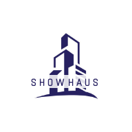

<p align="center">
  
</p>


<h1 align="center">Showhaus</h1>

<p align="center">
  Singapore property exploration with a React map frontend, NestJS API, PostGIS database, and Martin vector tile server.
</p>

https://github.com/user-attachments/assets/776f9dc3-b76c-46f7-b228-e8f34c1910c1

## Overview

Showhaus is a monorepo for exploring Singapore property data on an interactive map.

- `apps/app` - React web app for map-based property exploration.
- `apps/api` - NestJS API for property, land-use, school, tile, transaction, and scraper services.
- `docker-compose.yml` - Local full-stack development environment with PostgreSQL/PostGIS, Martin, pgAdmin, API, and frontend services.

## Repository Layout

```text
.
├── apps
│   ├── api
│   │   ├── Dockerfile
│   │   └── .env.example
│   └── app
│       ├── Dockerfile
│       └── .env.example
├── docker-compose.yml
├── package.json
└── README.md
```

Each application keeps its own dependencies and lockfile. The root `package.json` provides convenience scripts for common development commands.

## Prerequisites

- Docker and Docker Compose
- Node.js and Yarn 1.x, if running services outside Docker
- Optional external credentials:
  - URA API key
  - Google Maps API key
  - Google OAuth client ID and secret
  - Mapbox API key for the frontend map

## Quick Start With Docker Compose

Copy the example environment files:

```bash
cp apps/api/.env.example apps/api/.env
cp apps/app/.env.example apps/app/.env
```

Edit the copied files and replace placeholder values as needed. For a basic local boot, the default database settings are already aligned with `docker-compose.yml`; map and external API features require real API keys.

Start the full stack from the repository root:

```bash
docker compose up --build
```

Or use the root Yarn wrapper:

```bash
yarn dev
```

The Docker Compose stack starts:

| Service | URL / Port | Notes |
|---|---:|---|
| Frontend | http://localhost:3210 | React development server |
| API | http://localhost:8080/api | NestJS API |
| Martin | http://localhost:3333 | Vector tile server and web UI |
| pgAdmin | http://localhost:5051 | Default login can be set with `PGADMIN_DEFAULT_EMAIL` and `PGADMIN_DEFAULT_PASSWORD` |
| PostgreSQL/PostGIS | localhost:5433 | Container port is `5432`; database data is stored in the `pgdata` Docker volume |

Stop the stack:

```bash
docker compose down
```

Stop the stack and remove persisted database data:

```bash
docker compose down -v
```

## Environment Variables

Create local environment files from the examples before running the app:

```bash
cp apps/api/.env.example apps/api/.env
cp apps/app/.env.example apps/app/.env
```

Important API variables:

| Variable | Purpose |
|---|---|
| `PORT` | API port, defaults to `8080` |
| `POSTGRES_HOST` | Use `postgres_db` inside Docker Compose, or `localhost` from the host |
| `POSTGRES_PORT` | Use `5432` inside Docker Compose, or `5433` from the host |
| `POSTGRES_USER` | Local PostgreSQL user |
| `POSTGRES_PASSWORD` | Local PostgreSQL password |
| `POSTGRES_DB` | Local PostgreSQL database |
| `MARTIN_BASE_URL` | Martin tile server URL |
| `URA_API_KEY` | Optional URA API integration |
| `GOOGLE_MAPS_API_KEY` | Optional Google Maps integration |
| `GOOGLE_CLIENT_ID` / `GOOGLE_CLIENT_SECRET` | Optional Google OAuth integration |

Important frontend variables:

| Variable | Purpose |
|---|---|
| `PORT` | Frontend dev server port, defaults to `3210` |
| `REACT_APP_SHOWHOUSE_API_URL` | API base URL, usually `http://localhost:8080/api` |
| `REACT_APP_MAPBOX_API_KEY` | Mapbox token used by the map UI |

Do not commit real `.env` files or production credentials.

## Local Development Without Docker

Install dependencies for both apps:

```bash
yarn api:install
yarn app:install
```

Start the API in watch mode:

```bash
yarn api:start:dev
```

Start the frontend in a separate terminal:

```bash
yarn app:start
```

When running without Docker, make sure PostgreSQL/PostGIS is available and the API `.env` file points at the correct host and port.

## Common Commands

| Command | Description |
|---|---|
| `yarn dev` | Run the full Docker Compose stack |
| `yarn dev:down` | Stop Docker Compose containers |
| `yarn api:install` | Install API dependencies |
| `yarn api:build` | Build the NestJS API |
| `yarn api:test` | Run API tests |
| `yarn api:start:dev` | Run the API in watch mode |
| `yarn api:scrape:newlauncher` | Run the NewLauncher scraper |
| `yarn app:install` | Install frontend dependencies |
| `yarn app:build` | Build the React app |
| `yarn app:test` | Run frontend tests |
| `yarn app:start` | Run the React development server |

## Verification

From the repository root:

```bash
yarn api:build
yarn --cwd apps/api test --runInBand

yarn app:build
CI=true yarn --cwd apps/app test --watchAll=false
```

## Security

- Keep `.env` files, API keys, OAuth secrets, database dumps, and private keys out of git.
- Treat `.env.example` values as local placeholders only.
- Rotate any credential that is ever committed by mistake.
- Use a deployment platform secret manager for production credentials.

## License

This project is licensed under the [MIT License](LICENSE).
